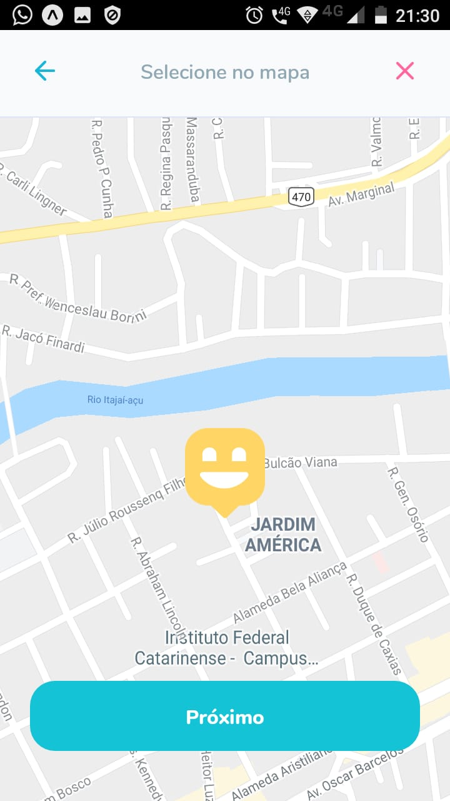
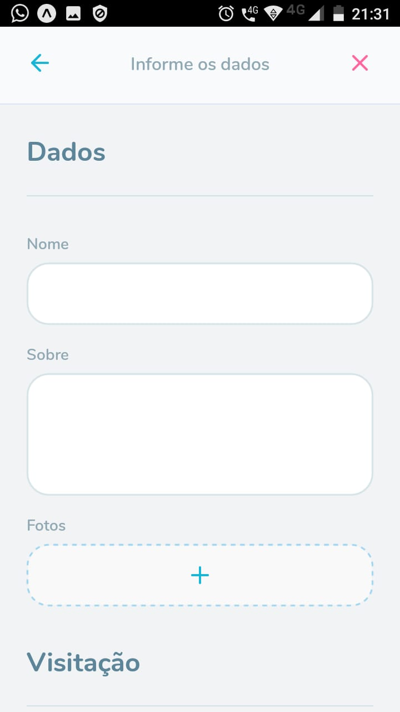
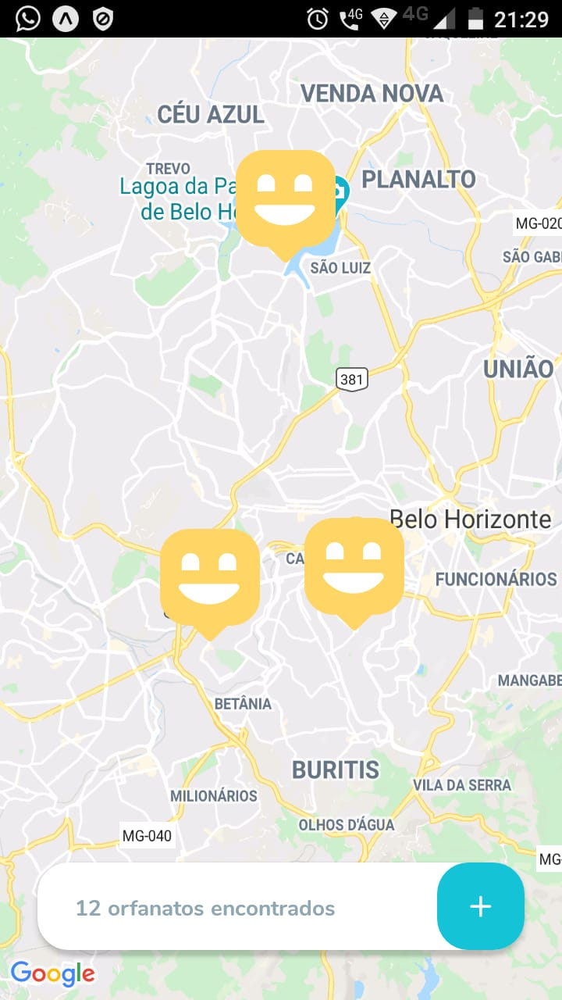
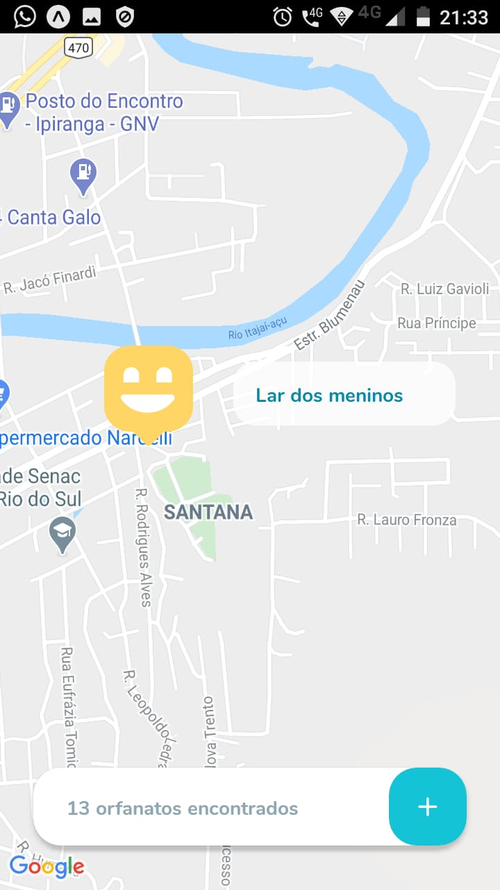
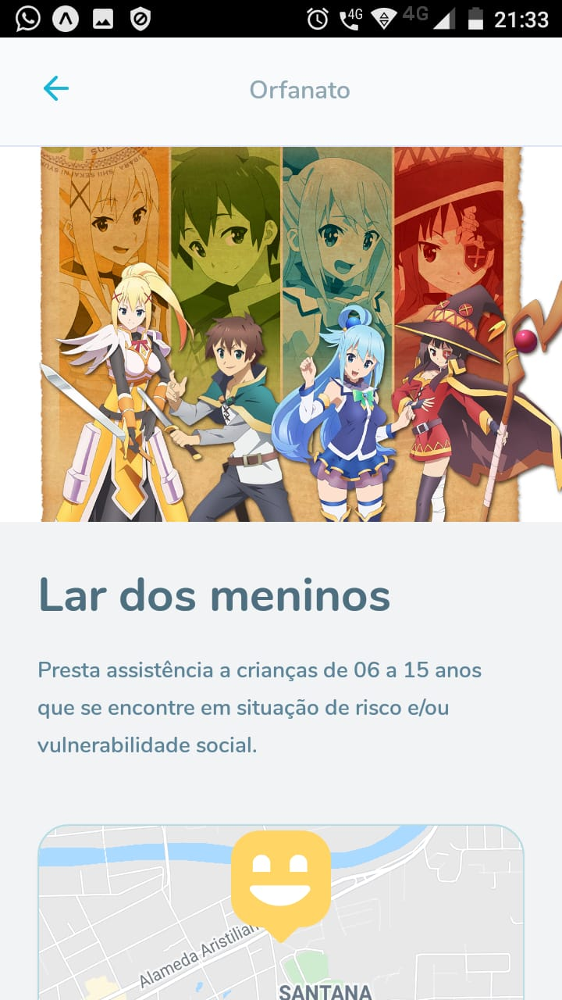
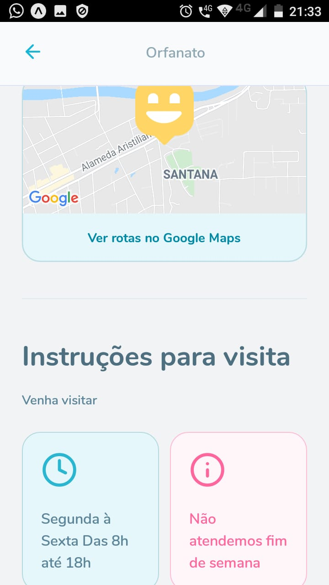

  

  

  
   

  

<h1 align="center">
  Happy
</h1>

<h4 align="center"> 
	🚧  Happy 🧍‍♀️🧍‍♂️ Concluído 🚀 🚧
</h4>

 <a href="#-sobre-o-projeto">Sobre</a> •
 <a href="#-funcionalidades">Funcionalidades</a> •
 <a href="#-layout">Layout</a> • 
 <a href="#-como-executar-o-projeto">Como executar</a> • 
 <a href="#-tecnologias">Tecnologias</a> • 
 <a href="#-autor">Autor</a> • 
 <a href="#user-content--licença">Licença</a>

## 💻 Sobre o projeto

🧍‍♀️🧍‍♂️ Happy - é um projeto que une orfanatos e pessoas que desejam visitar ou adotar uma criança.

Projeto desenvolvido durante a **NLW - Next Level Week** oferecida pela [Rocketseat](https://blog.rocketseat.com.br/primeira-next-level-week/).
O NLW é uma experiência online com muito conteúdo prático, desafios e hacks onde o conteúdo fica disponível durante uma semana.

---

## ⚙️Funcionalidades

- [x] Pessoas físicas podem fazer buscas na plataforma
- [x] Instituições de Orfanatos podem se cadastras na plataforma
- [x] nome da entidade, sobre, instruções, fotos, horario de funcionamento e se funciona final de semana
- [x] e o endereço para que ele possa aparecer no mapa

---

## 🎨 Layout

O layout da aplicação está disponível no Figma:

### Mobile

---

## 🚀 Como executar o projeto

Este projeto é divido em três partes:
1. Backend (pasta server) <a href="https://github.com/RodrigoJuniorLiyah/Happy--Backend/archive/master.zip">baixe aqui</a>
2. Frontend (pasta web) <a href="https://github.com/RodrigoJuniorLiyah/Happy--Web---Rocketseat/archive/master.zip">baixe aqui</a>
3. Mobile (pasta mobile) <a href="https://github.com/RodrigoJuniorLiyah/Happy--Mobile---Rocketseat/archive/master.zip">baixe aqui</a>

💡Tanto o Frontend quanto o Mobile precisam que o Backend esteja sendo executado para funcionar.

### Pré-requisitos

Antes de começar, você vai precisar ter instalado em sua máquina as seguintes ferramentas:
[Git](https://git-scm.com), [Node.js](https://nodejs.org/en/).
Além disto é bom ter um editor para trabalhar com o código como [VSCode](https://code.visualstudio.com/)

---

## 🛠 Tecnologias

As seguintes ferramentas foram usadas na construção do projeto:

#### **Mobile**  ([React Native](http://www.reactnative.com/)  +  [TypeScript](https://www.typescriptlang.org/))

-   **[Expo](https://expo.io/)**
-   **[Expo Google Fonts](https://github.com/expo/google-fonts)**
-   **[React Navigation](https://reactnavigation.org/)**
-   **[React Native Maps](https://github.com/react-native-community/react-native-maps)**
-   **[Expo Constants](https://docs.expo.io/versions/latest/sdk/constants/)**
-   **[React Native SVG](https://github.com/react-native-community/react-native-svg)**
-   **[Axios](https://github.com/axios/axios)**
-   **[Expo Location](https://docs.expo.io/versions/latest/sdk/location/)**

> Veja o arquivo [package.json](https://github.com/RodrigoJuniorLiyah/Happy--Web---Rocketseat/blob/master/package.json)

## 💪 Como contribuir para o projeto

1. Faça um **fork** do projeto.
2. Crie uma nova branch com as suas alterações: `git checkout -b my-feature`
3. Salve as alterações e crie uma mensagem de commit contando o que você fez: `git commit -m "feature: My new feature"`
4. Envie as suas alterações: `git push origin my-feature`

  > Caso tenha alguma dúvida confira este [guia de como contribuir no GitHub](./CONTRIBUTING.md)
---

## 🐱‍👤Autor

 
 <b>Rodrigo junior 🚀</b>
  

 

---

## 📝 Licença

Este projeto esta sobe a licença [MIT](./LICENSE).

Feito com ❤️ por Rodrigo Junior 👋🏽 [Entre em contato!](https://www.linkedin.com/in/rodrigo-junior-969184166/)
